# Credit_Risk_Analysis

For this deliverable, you’ll write a brief summary and analysis of the performance of all the machine learning models used in this Challenge.
The report should contain the following:
The written analysis has the following structure, organization, and formatting:
There is a title, and there are multiple sections
Each section has a heading and subheading
Links to images are working, and code is formatted and displayed correctly

## Overview of the analysis:

Explain the purpose of this analysis.
Overview of the loan prediction risk analysis:
The purpose of this analysis is well defined
 
 

## Results:

(Using bulleted lists, describe the balanced accuracy scores and the precision and recall scores of all six machine learning models. Use screenshots of your outputs to support your results.
The written analysis has the following:
There is a bulleted list that describes the balanced accuracy score and the precision and recall scores of all six machine learning models)

### Oversampling

- Naive Random Oversampling

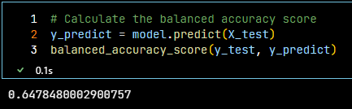
 
Naive Random Oversampling Accuracy Score

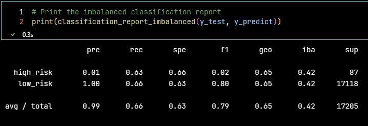
 
Naive Random Oversampling Classification Report
 

- SMOTE Algorithm

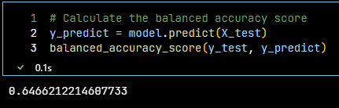
 
SMOTE Accuracy Score

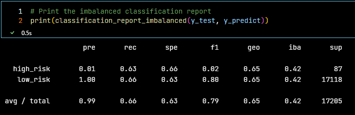
 
SMOTE Classification Report
 

### Undersampling

- Cluster Centroids

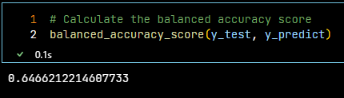
 
Cluster Centroids Accuracy Score

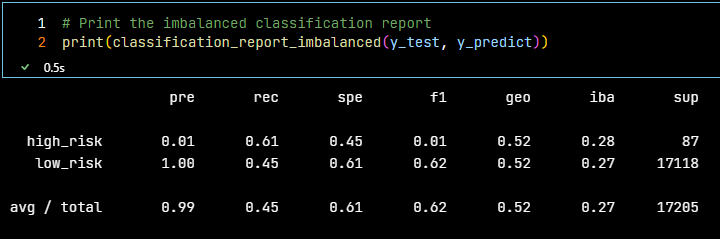
 
Cluster Centroids Classification Report
 

### Combination (Over and Under) Sampling

- SMOTEENN Algorithm

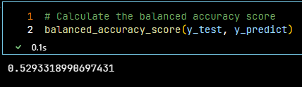
 
SMOTEENN Accuracy Score

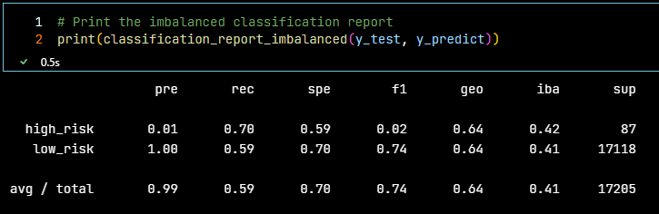
 
SMOTEENN Classification Report
 

### Ensemble Learners

- Balanced Random Forest Classifier

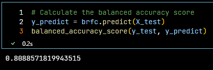
 
Balanced Random Forest Classifier Accuracy Score

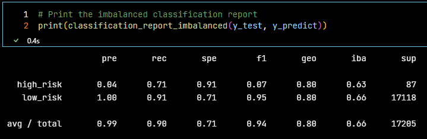
 
Balanced Random Forest Classifier Classification Report
 

- Easy Ensemble AdaBoost Classifier

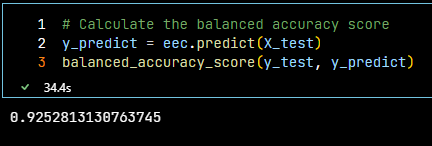
 
Easy Ensemble AdaBoost Classifier Accuracy Score

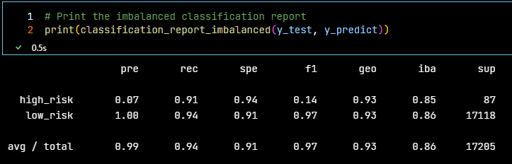
 
Easy Ensemble AdaBoost Classifier Classification Report
 
 

## Summary:

Summarize the results of the machine learning models, and include a recommendation on the model to use, if any. If you do not recommend any of the models, justify your reasoning.
